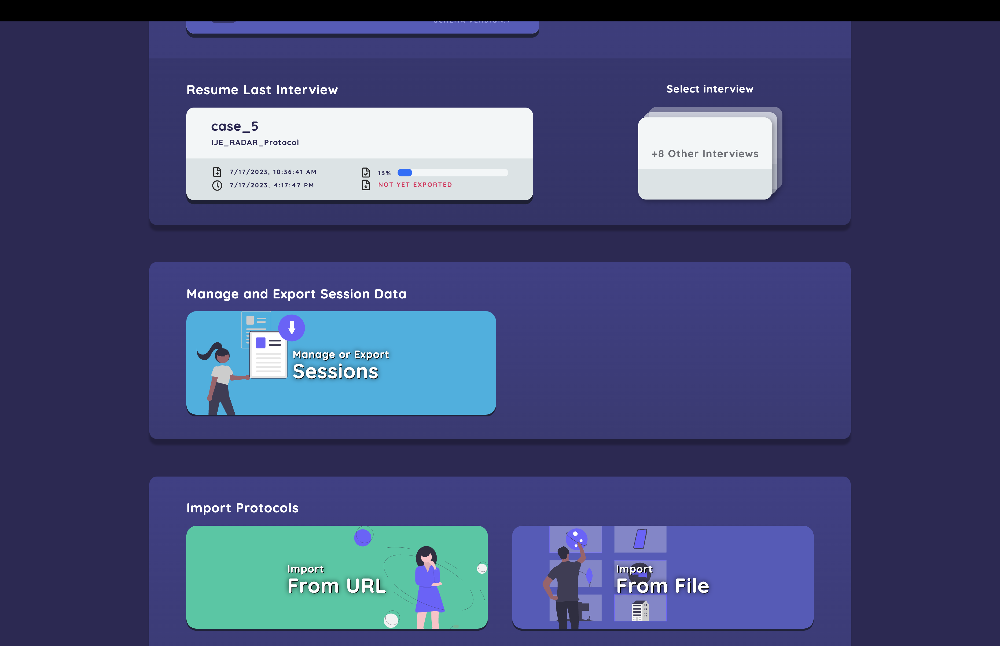
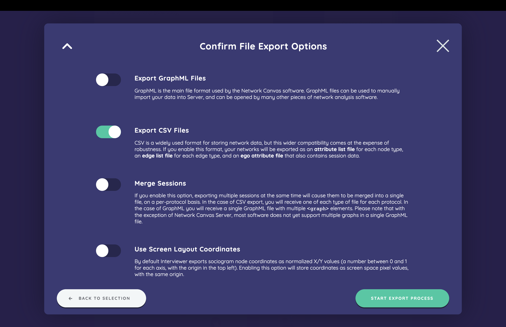
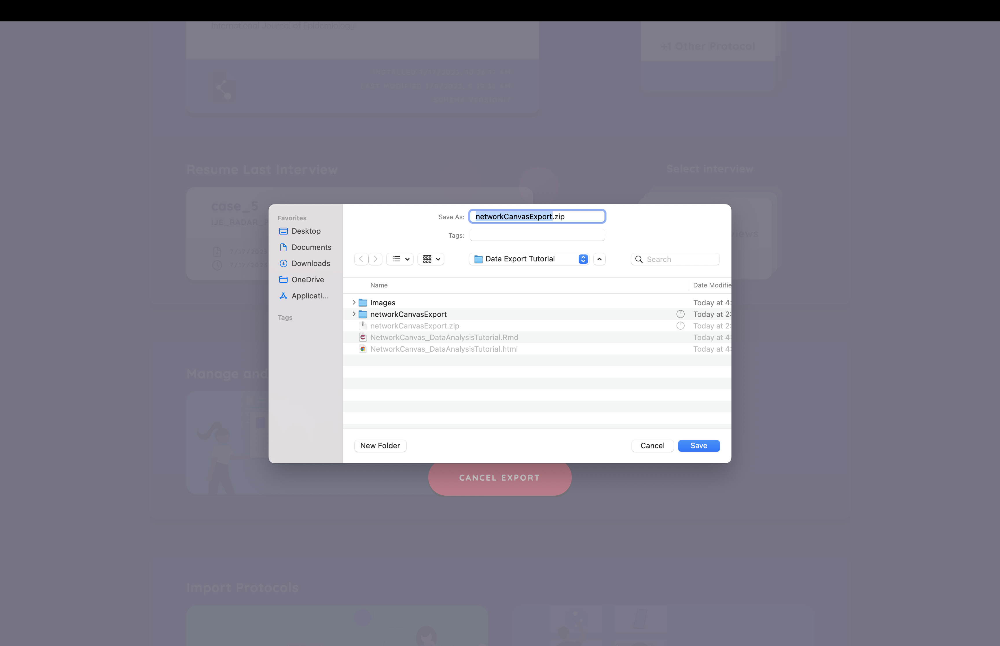

This Notebook provides basic examples of import and analysis in R using data from the [*Network Canvas*](http://networkcanvas.com) software. The example will use simulated data from the following network canvas [protocol file](https://github.com/complexdatacollective/working-with-data/raw/main/IJE_RADAR_Protocol.netcanvas) which can be opened in the Network Canvas Interviewer or Architect apps. The data used in this tutorial can also be found [here](https://github.com/complexdatacollective/working-with-data/blob/main/networkCanvasExport.zip).

### Export data from Network Canvas
The first step in exporting data from Network Canvas is to navigate to the Manage and Export Session data in the Interviewer app.

$~$

Next, you'll indicate which sessions you want to export by selecting the appropriate cards and clicking "Export Selected To File."


$~$

Next, we'll confirm export options. We will focus on the CSV export in this tutorial. I also leave the "Merge Sessions" option unselected because I prefer to aggregate session data manually in R, as I will demonstrate below. 


$~$

Finally, after a short wait, we simply select where we would like the zip file containing all our data to be saved on our computer. We will need to unzip the file before starting our data analysis described below


### Import and clean the data

Next we want to load the data into R. We use the *egor* to do this, using examples derived from an egor [vignette](https://cran.r-project.org/web/packages/egor/vignettes/using_egor.html)


```{r,message = FALSE}
# Load egor
library(egor)
library(sna)
library(ggplot2)

# This assumes the the data was unzipped to the "networkCanvasExport" folder that is located in the same folder as this script
# If the you have data somewhere else, set that folder path here:
folderPath <- paste0(getwd(),'/networkCanvasExport/')

# Read each type of file into list, combine into single data frame
alterData <- folderPath %>%
  list.files(full.names=TRUE,pattern="attributeList_Person.csv") %>%
  lapply(read.csv) %>%
  bind_rows()

edgelistData_Close <- folderPath %>%
  list.files(full.names=TRUE,pattern="edgeList_Close.csv") %>%
  lapply(read.csv) %>%
  bind_rows()

edgelistData_SexTie <- folderPath %>%
  list.files(full.names=TRUE,pattern="edgeList_SexTie.csv") %>%
  lapply(read.csv) %>%
  bind_rows()

edgelistData_DrugTie <- folderPath %>%
  list.files(full.names=TRUE,pattern="edgeList_DrugTie.csv") %>%
  lapply(read.csv) %>%
  bind_rows()

egoData <- folderPath %>%
  list.files(full.names=TRUE,pattern="ego.csv") %>%
  lapply(read.csv) %>%
  bind_rows()
```


Now we can examine if the data looks like it should from the alter file. As you'll see, the alter data file contains a unique alter identifier (i.e., "networkCanvasUUID") as well as a unique ego identifier (i.e., "networkCanvasEgoUUID") which will both be used to define the egor object.
```{r}
head(alterData[,c("nodeID","networkCanvasEgoUUID","networkCanvasUUID","Close","Drugs","Sex","Age")])
```
### Recoding categorical variables
Categorical variables from Network Canvas export as one column per category with a Boolean value for each possible category. However, researchers frequently want to convert these variables to a single factor column in R. This helper function can help you achieve that. 
```{r}
catToFactor <- function(dataframe,variableName) {
    fullVariableName <- paste0(variableName,"_")
    catVariables <- grep(fullVariableName, names(dataframe), value=TRUE)
    # Check if variable exists
    if (identical(catVariables, character(0))){
      stop(paste0("Cannot find variable named -",variableName,"- in the data"))
    # Check if "true" in multiple columns of a single row
    } else if (sum(apply(dataframe[,catVariables], 1, function(x) sum(x %in% "true")>1))>0) {
      stop(paste0("Your variable -",variableName,"  - appears to take multiple values.")) }
    catValues <- sub(paste0('.*',fullVariableName), '', catVariables)
    factorVariable <- c()
    for(i in 1:length(catVariables)){
      factorVariable[dataframe[catVariables[i]]=="true"] <- catValues[i]
    }
    return(factor(factorVariable,levels=catValues))
}
```

Using this function, we can recode three variables from the current protocol into factors
```{r}
# List of categorical variables in our protocol to convert into factors
categoricalVariablesList <- list('Gender','Race','SexOrient')

# Iterate the list and call our catToFactor function, assigning the result to a new column in our dataframe
for (variable in categoricalVariablesList) {
  alterData[variable] <- catToFactor(alterData, variable)
}
```


### Miscellaneous data cleaning 
We'll want to do a little data cleaning by contact frequency and counting the number of substances participants reported using, before loading it into an egor object.
```{r}

alterData$ContactFreq[alterData$ContactFreq=="Less_than_weekly"] <- "Less than \n weekly"

countTrues <- function(vector) {
  length(which(vector=="true"))
}
drugNames <-c("MarijuanaUsed","CocaineUsed","HeroinUsed","PainkillersUsed","PoppersUsed")
egoData$numberDrugs <- apply(egoData[,c(drugNames)],FUN=countTrues,MARGIN=1)
```

### Create an egor object

After loading and cleaning the data, we still need to make it into an egor object. Although we have 3 data files with edgelist data, we'll be focusing on "Close" social ties for the remainder of this tutorial
```{r}
# Load the file into R
egorNetworkCanvas <- egor(alters = alterData,
           egos = egoData,
           aaties = edgelistData_Close,
           ID.vars = list(
             ego = "networkCanvasEgoUUID",
             alter = "networkCanvasUUID",
             source = "networkCanvasSourceUUID",
             target = "networkCanvasTargetUUID"))
```

### Data visualization

Lets start with a simple visualization of one ego network. To do this we'll first convert it to a 'network' object and use the gplot function from the sna package. This visualization shows the new node labels and colors each node by the contact frequency with the participant. We also layout the figure with the final coordinates from the sociogram stage.
```{r}

oneEgoNet <- as_network(egorNetworkCanvas)[[9]]
oneEgoNet%v%"vertex.names" <- oneEgoNet%v%"name"

colorScheme <- c( "#CC6677", "#117733", "#AA4499",
                  "#6699CC")

# A little recoding to get a color for each frequency
nodeColors <- ifelse(oneEgoNet%v%"ContactFreq"=="Daily",colorScheme[1],
                    ifelse(oneEgoNet%v%"ContactFreq"=="Weekly",colorScheme[2],
                           ifelse(oneEgoNet%v%"ContactFreq"=="Less than \n weekly",colorScheme[3],
                                  colorScheme[4])))

gplot(oneEgoNet,
       usearrows = FALSE,
       label = oneEgoNet%v%"name",
       displaylabels = TRUE,
       vertex.col=nodeColors,
       edge.col="gray",
       coord = matrix(c(as.numeric(oneEgoNet%v%"Cords_x"),
                        -as.numeric(oneEgoNet%v%"Cords_y")),
                        nrow=length(unique(oneEgoNet%v%"name")),
                        ncol=2))
```

As you can see, this only shows a single egocentric network. However, the egor package has several functions that facilitate comparison of networks across ego nets. For example, here is a visualization showing each ego net with nodes location being dependent on their frequency of contact with the participant and their status as a drug partner (i.e., true/false).

```{r}
# Make a visualization displaying both frequency of communication and family member status
plot(egorNetworkCanvas, venn_var = "Drugs",
     pie_var = "ContactFreq",vertex_label_var="nodeID",
     type = "egogram")
```

## Data analysis

The egor package has numerous functions that help with basic data analysis of ego networks. For example, the *summary* function provides an overview of all ego networks in the egor while the *ego_density* functions provides the density for each participant's network.

```{r}
summary(egorNetworkCanvas)

ego_density(egorNetworkCanvas)

```
We can also use a traditional package, such as *sna*, to look at these networks by applying functions (i.e., lapply) to each of these networks and aggregating the results. For example, here we first make a simple histogram of alter degrees across all ego networks.

```{r}
networkNetworkCanvas <- as_network(egorNetworkCanvas)

histData <- networkNetworkCanvas %>%
  lapply(degree,cmode="indegree") %>%
  unlist(recursive = FALSE) %>%
  as.data.frame()

histData$degree <- as.numeric(histData$".")

ggplot(histData, aes(x=degree)) +
    geom_histogram(color="black", fill="white",bins=5) +
    theme_classic()

```

Finally, we often want to examine how an ego attribute may be associated with ego network characteristics. In this example we look at the association between the number of substances a participant reported using and the density of their ego network.
```{r}
ego_density(egorNetworkCanvas) %>%
  full_join(egorNetworkCanvas$ego,by=".egoID") %>%
  ggplot(aes(x = numberDrugs, y = density)) +
    geom_point(size=5) +
    geom_text(label=egorNetworkCanvas$ego$networkCanvasCaseID, aes(vjust=c(-1.5))) +
    ylim(0,1.05) + theme_classic()
```
