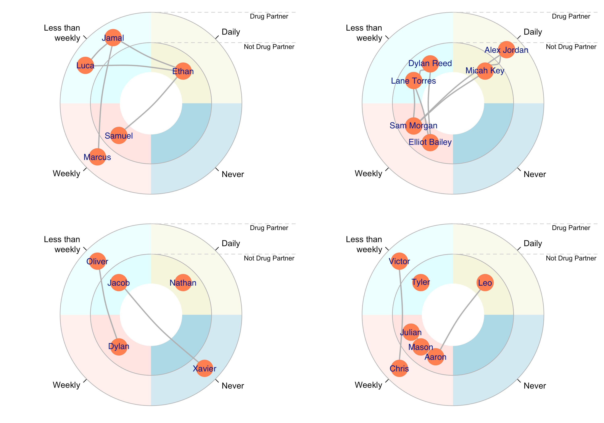

# Head Summary

Summary:
This tutorial will show you how to work with Network Canvas data in the R statistics environment, using the [`ideanet`](https://cran.r-project.org/web/packages/ideanet/index.html) package.

Prerequisites:
In order to follow along with this tutorial you should: (1) Have an understanding of the R environment. (2) Have a working installation of R studio, or similar, in order to enter commands.

Duration:
30 minutes


## Introduction

This tutorial provides an example of an import and analysis workflow for [Network Canvas](https://networkcanvas.com/) data in the R statistical environment using the [ideanet](https://cran.r-project.org/web/packages/ideanet/index.html) and [ego-R](https://cran.r-project.org/web/packages/egor/index.html) packages. This example uses simulated data from the following [Network Canvas protocol file](https://github.com/complexdatacollective/working-with-data/raw/main/IJE_RADAR_Protocol.netcanvas) which can be opened in the Network Canvas Interviewer or Architect apps. If you are following this example with your own protocol, you will first want to export data collected using your protocol. We do not cover the export process here, but we encouage you to consult [this article](https://documentation.networkcanvas.com/en/desktop/tutorials/protocol-and-data-workflows) should you need to review it. Note that you will want to export your data using the CSV option and not the GraphML option for this workflow.

If you are not using your own protocol, you can download the CSV files used in this tutorial  [here](https://github.com/complexdatacollective/working-with-data/raw/main/networkCanvasExport.zip). Downloading the protocol file linked above is optional, but it is highly encouraged that you do so as well. The workflow in this tutorial uses tools that can read in Network Canvas protocol files and use information stored in these files to process data more effectively.

Should you require more resources, or if you are just generally curious, a complete GitHub repository for this tutorial can be found [here](https://github.com/complexdatacollective/working-with-data).

## Locating your data

Assuming you have either downloaded our example data or successfully exported your own data, you should now have a folder of Network Canvas CSV files somewhere on your computer. The contents of this folder should look something like the screenshot below (note that the start of each file name will likely be different if you are working with your own data):


Once you have your data, the first thing you will want to do in R is to create an object that stores the path to this folder as a character value.


``` r
# Store path to folder with Network Canvas data
### Note that this path will almost certainly be different on your own computer
path_to_data <- paste0(getwd(),'/networkCanvasExport/')
```

If you are going to use your Network Canvas protocol file, as we recommended earlier, you will also want to store the path to the protocol file in another object.


``` r
# Store path to Network Canvas protocol file
### Note that this path will almost certainly be different on your own computer
path_to_protocol <- paste0(getwd(),'/IJE_RADAR_Protocol.netcanvas')
```


## Reading in data using ideanet 

Once we have these paths defined, we turn to the [`ideanet`](https://cran.r-project.org/web/packages/ideanet/index.html) package to load our data into R. The `ideanet` package offers a function specifically for reading data collected using Network Canvas, entitled `nc_read`. `nc_read` takes one main argument, `path`, a character value indicating the folder containing the Network Canvas CSV files we want to process. If you also have the Network Canvas protocol file used to collect your data, you can specify its location to `nc_read` using the `protocol` argument. While optional, this argument allows `nc_read` to access information contained in your protocol file that ensures better coding of categorical variables in your data. It is generally best practice to use your protocol file with `nc_read` if its is available to you.

Note that we have already specified the locations of our data (`path_to_data`) and our protocol file (`path_to_protocol`), making it easy to proceed with `nc_read`:


``` r
# Load `ideanet`
library(ideanet)

# Set up `nc_read`
nc_data <- nc_read(path = path_to_data,
                   protocol = path_to_protocol)
```

Our data are now loaded into R and stored in the `nc_data` object. `nc_data` is a list object containing three items frequently used to store egocentric network data. 

### Ego list

The first of these items is a data frame entitled `egos`. This data frame is an *ego list* containing data pertaining to each participant, or ego, who completed our Network Canvas protocol. Each row in the ego list corresponds to a specific ego, who is given a unique identification number. These identification numbers are separate from the unique case and session ID numbers given by the Network Canvas software; however, they perfectly correspond to one another and can be used interchangeably depending on your preference. 


``` r
head(nc_data$egos)
```

```
## # A tibble: 6 × 23
##   ego_id networkCanvasEgoUUID         networkCanvasCaseID networkCanvasSessionID networkCanvasProtoco…¹ sessionStart        sessionFinish       sessionExported     DrugsUsed_1
##    <int> <chr>                        <chr>               <chr>                  <chr>                  <dttm>              <dttm>              <dttm>              <lgl>      
## 1      6 6e26f4dd-64ea-4ae5-8447-dfb… case_1              54ba71fa-808e-4ed5-a6… IJE_RADAR_Protocol     2024-12-17 16:04:03 2024-12-17 16:09:20 2024-12-17 18:23:42 FALSE      
## 2      2 2a891fd1-a8e9-49a8-9ee3-65c… case_10             8e63e94a-d761-4823-a9… IJE_RADAR_Protocol (1) 2024-12-17 18:49:56 2024-12-17 19:01:21 2024-12-17 20:12:55 FALSE      
## 3      5 66a48c32-f5b7-4161-8833-490… case_2              b11bed2e-4daf-49dc-ad… IJE_RADAR_Protocol     2024-12-17 16:35:06 2024-12-17 16:40:15 2024-12-17 18:23:42 FALSE      
## 4      9 d3e7a9b9-845b-4611-9253-a6a… case_3              fd5e0e36-d35c-455a-b0… IJE_RADAR_Protocol     2024-12-17 16:52:22 2024-12-17 17:01:07 2024-12-17 18:23:42 FALSE      
## 5      7 73f7a086-46fd-4589-a66e-41d… case_4              602140e1-c5cb-46ac-bf… IJE_RADAR_Protocol     2024-12-17 18:07:46 2024-12-17 18:12:55 2024-12-17 18:23:42 FALSE      
## 6      8 769efcdc-947a-42e2-aabe-803… case_5              74a68643-6e7a-4abb-97… IJE_RADAR_Protocol     2024-12-17 18:13:11 2024-12-17 18:23:28 2024-12-17 18:23:42 FALSE      
## # ℹ abbreviated name: ¹​networkCanvasProtocolName
## # ℹ 14 more variables: DrugsUsed_2 <lgl>, DrugsUsed_3 <lgl>, DrugsUsed_4 <lgl>, DrugsUsed_5 <lgl>, DrugsUsed_6 <lgl>, DrugsUsed_7 <lgl>, DrugsUsed_8 <lgl>, DrugsUsed_9 <lgl>,
## #   MarijuanaUsed <lgl>, CocaineUsed <lgl>, HeroinUsed <lgl>, PainkillersUsed <lgl>, PoppersUsed <lgl>, DrugsUsed <fct>
```

### Alter list

The second item in `nc_data`, `alters`, contains one or more *alter lists* detailing data pertaining to relationships between participants and the entities in their networks, whom we refer to as "alters." Each row in an alter list corresponds to an individual alter in an ego's network:


``` r
head(nc_data$alters)
```

```
##   ego_id alter_id node_type                 networkCanvasEgoUUID                    networkCanvasUUID Close Drugs  Sex   Cords_x   Cords_y Age      ContactFreq
## 1      6        1    Person 6e26f4dd-64ea-4ae5-8447-dfb44bed3354 4a517084-363c-4e17-89b0-aac53950c993  TRUE    NA TRUE 0.3615846 0.4097614  29            Daily
## 2      6        2    Person 6e26f4dd-64ea-4ae5-8447-dfb44bed3354 5190efca-1a87-470d-9434-5dc030d2ed8f  TRUE  TRUE TRUE 0.7144737 0.4421547  34           Weekly
## 3      6        3    Person 6e26f4dd-64ea-4ae5-8447-dfb44bed3354 01ab4b4f-c12d-46df-aaef-78c335736baa  TRUE  TRUE   NA 0.3409164 0.6955170  25 Less_than_weekly
## 4      6        4    Person 6e26f4dd-64ea-4ae5-8447-dfb44bed3354 9152d2e4-8721-40e5-9de1-15179da0fdb0  TRUE  TRUE   NA 0.4779385 0.7371656  42 Less_than_weekly
## 5      6        5    Person 6e26f4dd-64ea-4ae5-8447-dfb44bed3354 555af46c-b373-49ef-a90d-a9b7e02d2420  TRUE    NA TRUE 0.5208057 0.2767173  38           Weekly
## 6      2        1    Person 2a891fd1-a8e9-49a8-9ee3-65c87e953793 a37daaa8-0d4a-4f38-9904-12ad40c62564  TRUE  TRUE   NA 0.4157751 0.3404244  27            Daily
##        RelStrength Serious Gender_Female Gender_Male Gender_Gender_non.conforming Gender_Genderqueer Gender_Non.binary Gender_Agender Gender_Dont_know Gender_Not_listed
## 1       Very_close    TRUE         FALSE        TRUE                        FALSE              FALSE             FALSE          FALSE            FALSE             FALSE
## 2       Very_close      NA         FALSE        TRUE                        FALSE              FALSE             FALSE          FALSE            FALSE             FALSE
## 3   Somewhat_close      NA         FALSE        TRUE                        FALSE              FALSE             FALSE          FALSE            FALSE             FALSE
## 4 Not_close_at_all      NA         FALSE        TRUE                        FALSE              FALSE             FALSE          FALSE            FALSE             FALSE
## 5   Somewhat_close    TRUE         FALSE       FALSE                        FALSE               TRUE             FALSE          FALSE            FALSE             FALSE
## 6       Very_close      NA         FALSE        TRUE                        FALSE              FALSE             FALSE          FALSE            FALSE             FALSE
##   Hispanic_Hispanic_or_Latino Hispanic_Not_Hispanic_or_Latino Race_Black_African_American Race_American_Indian_or_Alaskan_Native Race_Asian Race_White
## 1                       FALSE                            TRUE                       FALSE                                  FALSE       TRUE      FALSE
## 2                       FALSE                            TRUE                        TRUE                                  FALSE      FALSE      FALSE
## 3                       FALSE                            TRUE                       FALSE                                  FALSE      FALSE       TRUE
## 4                       FALSE                            TRUE                        TRUE                                  FALSE      FALSE      FALSE
## 5                       FALSE                            TRUE                       FALSE                                  FALSE      FALSE       TRUE
## 6                       FALSE                            TRUE                        TRUE                                  FALSE      FALSE      FALSE
##   Race_Native_Hawaiian_or_Other_Pacific_Islander Race_Other SexOrient_Bisexual SexOrient_Heterosexual_Straight SexOrient_Gay_Lesbian SexOrient_Queer SexOrient_Not_listed
## 1                                          FALSE      FALSE              FALSE                           FALSE                  TRUE           FALSE                FALSE
## 2                                          FALSE      FALSE              FALSE                           FALSE                  TRUE           FALSE                FALSE
## 3                                          FALSE      FALSE              FALSE                           FALSE                  TRUE           FALSE                FALSE
## 4                                          FALSE      FALSE              FALSE                           FALSE                  TRUE           FALSE                FALSE
## 5                                          FALSE      FALSE              FALSE                           FALSE                  TRUE           FALSE                FALSE
## 6                                          FALSE      FALSE              FALSE                           FALSE                  TRUE           FALSE                FALSE
##   SexOrient_Dont_want_to_answer SexOrient_Dont_know              MarijuanaFreq CocaineFreq HeroinFreq PainkillerFreq PoppersFreq PlaceMet_Bar_Club PlaceMet_Online_Mobile_App
## 1                         FALSE               FALSE                       <NA>          NA       <NA>           <NA>        <NA>             FALSE                      FALSE
## 2                         FALSE               FALSE Not_in_the_past_six_months          NA       <NA>           <NA>       Daily             FALSE                       TRUE
## 3                         FALSE               FALSE Not_in_the_past_six_months          NA       <NA>           <NA>       Daily             FALSE                      FALSE
## 4                         FALSE               FALSE           Less_Than_Weekly          NA       <NA>           <NA>       Daily             FALSE                      FALSE
## 5                         FALSE               FALSE                       <NA>          NA       <NA>           <NA>        <NA>              TRUE                      FALSE
## 6                         FALSE               FALSE                     Weekly          NA       <NA>         Weekly        <NA>             FALSE                      FALSE
##   PlaceMet_School PlaceMet_Work PlaceMet_Somewhere_Else AnalSex_Anal_sex AnalSex_No_anal_sex CondomCat_Condomless_anal_sex CondomCat_No_condomless_anal_sex        name
## 1            TRUE         FALSE                   FALSE             TRUE               FALSE                          TRUE                            FALSE       Ethan
## 2           FALSE         FALSE                   FALSE             TRUE               FALSE                         FALSE                             TRUE      Marcus
## 3           FALSE         FALSE                   FALSE            FALSE               FALSE                         FALSE                            FALSE        Luca
## 4           FALSE         FALSE                   FALSE            FALSE               FALSE                         FALSE                            FALSE       Jamal
## 5           FALSE         FALSE                   FALSE             TRUE               FALSE                         FALSE                             TRUE      Samuel
## 6           FALSE         FALSE                   FALSE            FALSE               FALSE                         FALSE                            FALSE Alex Jordan
##     FirstSex    LastSex OngoingPartner null      Gender               Hispanic                   Race   SexOrient          PlaceMet  AnalSex              CondomCat
## 1 2024-06-22 2024-11-21           TRUE   NA        Male Not_Hispanic_or_Latino                  Asian Gay_Lesbian            School Anal_sex    Condomless_anal_sex
## 2 2024-08-15 2024-08-30          FALSE   NA        Male Not_Hispanic_or_Latino Black_African_American Gay_Lesbian Online_Mobile_App Anal_sex No_condomless_anal_sex
## 3       <NA>       <NA>             NA   NA        Male Not_Hispanic_or_Latino                  White Gay_Lesbian              <NA>     <NA>                   <NA>
## 4       <NA>       <NA>             NA   NA        Male Not_Hispanic_or_Latino Black_African_American Gay_Lesbian              <NA>     <NA>                   <NA>
## 5 2024-10-08 2024-12-12           TRUE   NA Genderqueer Not_Hispanic_or_Latino                  White Gay_Lesbian          Bar_Club Anal_sex No_condomless_anal_sex
## 6       <NA>       <NA>             NA   NA        Male Not_Hispanic_or_Latino Black_African_American Gay_Lesbian              <NA>     <NA>                   <NA>
```

The first column in the alter list indicates the ego with whom a given alter is associated, the values for which match the unique ID numbers contained in `egos`. The second column indicates the given alter, and alters are also given a unique ID number within each ego network. 

The third column indicates the "type" of node associated with each alter as defined in the Network Canvas protocol. If the data collected by a protocol features multiple node types for alters, `nc_read` will make `alters` a list of data frames. Each data frame in this list is an alter list for a specific node type and will be given the name of their respective node type.

Subsequent columns contain additional data pertaining to each alter or an ego's relationship to that alter. Once more, ID numbers created within Network Canvas itself are also available to users. 

### Alter edgelists

The final item  created by `nc_read`, `alter_edgelists`, contains one or more *alter-alter edgelists* in which each row represent a tie connecting two alters within an ego's network to one another. Not all Network Canvas protocol collect data on ties between alters in an ego's network. Accordingly, `alter_edgelists` will only appear in `nc_data` if the user's data actually captures alter-alter-ties:


``` r
# Observe names of data frames stored in `alter_edgelists`
names(nc_data$alter_edgelists)
```

```
## [1] "Close"   "DrugTie" "SexTie"
```

In our example here, we see that `alter_edgelists` is a list containing three data frames named `Close`, `DrugTie`, and `SexTie`. This is because the Network Canvas protocol producing our data recorded three different "types" of alter-alter ties. `nc_read` creates a separate alter-alter edgelist for each type of tie, making it easier for users to extract only alter-alter ties they need for a specific purpose. Were our example protocol to have collected multiple node types for alters, the `alters` item in `nc_data` would have a similar organization.

Now that we know the structure of `alter_edgelists`, let's take a look at what's inside each data frame:


``` r
# Alter edgelist for "Close" ties
head(nc_data$alter_edgelists$Close)
```

```
##   ego_id edge_id edge_type from to                 networkCanvasEgoUUID                    networkCanvasUUID              networkCanvasSourceUUID
## 1      6       1     Close    3  4 6e26f4dd-64ea-4ae5-8447-dfb44bed3354 1e897182-ee07-44da-bf52-80510097139c 01ab4b4f-c12d-46df-aaef-78c335736baa
## 2      6       2     Close    1  4 6e26f4dd-64ea-4ae5-8447-dfb44bed3354 a0d5852b-7c86-4e49-a18b-7560f235455b 4a517084-363c-4e17-89b0-aac53950c993
## 3      6       3     Close    3  1 6e26f4dd-64ea-4ae5-8447-dfb44bed3354 bac69008-5883-4a04-84b3-251a5ce65845 01ab4b4f-c12d-46df-aaef-78c335736baa
## 4      6       4     Close    4  2 6e26f4dd-64ea-4ae5-8447-dfb44bed3354 2800ef8e-ca1a-4a08-be9c-27366fcc3e80 9152d2e4-8721-40e5-9de1-15179da0fdb0
## 5      6       5     Close    1  5 6e26f4dd-64ea-4ae5-8447-dfb44bed3354 b8cfa994-8b95-4832-9879-eb0fec37bcc3 4a517084-363c-4e17-89b0-aac53950c993
## 6      2       1     Close    4  3 2a891fd1-a8e9-49a8-9ee3-65c87e953793 2efffb0c-1d4b-4102-b776-4accad740649 596de58e-0376-4ea1-bc84-4f9d874b3714
##                networkCanvasTargetUUID AlterSexTie
## 1 9152d2e4-8721-40e5-9de1-15179da0fdb0          NA
## 2 9152d2e4-8721-40e5-9de1-15179da0fdb0          NA
## 3 4a517084-363c-4e17-89b0-aac53950c993          NA
## 4 5190efca-1a87-470d-9434-5dc030d2ed8f          NA
## 5 555af46c-b373-49ef-a90d-a9b7e02d2420          NA
## 6 6f052058-a26a-474b-8777-e4e74783e47a          NA
```


``` r
# Alter edgelist for "Drug" ties
head(nc_data$alter_edgelists$DrugTie)
```

```
##   ego_id edge_id edge_type from to                 networkCanvasEgoUUID                    networkCanvasUUID              networkCanvasSourceUUID
## 1      6       6   DrugTie    3  4 6e26f4dd-64ea-4ae5-8447-dfb44bed3354 470e0558-70fb-4f25-bdd7-800854c1eb88 01ab4b4f-c12d-46df-aaef-78c335736baa
## 2      9       4   DrugTie    4  3 d3e7a9b9-845b-4611-9253-a6a31dc265a7 432930b5-ae6d-4e80-9348-5b707db20bf0 1636454b-9e21-4d86-a853-df0e753d38a9
## 3      8       9   DrugTie    4  3 769efcdc-947a-42e2-aabe-803bb3a9219b 7af7a2c0-8138-4ac5-9493-495d1bc41e4a 7274b4dc-2136-4ae0-8642-04bc4cd54264
## 4      8      10   DrugTie    3  1 769efcdc-947a-42e2-aabe-803bb3a9219b fd3217d2-5ef5-419d-89a3-5d302547d48e 9de06bc5-3461-4e78-a8b6-7315f7e5aeb5
## 5      8      11   DrugTie    1  4 769efcdc-947a-42e2-aabe-803bb3a9219b 4ecf7793-27f9-4d6b-b2ac-9288e0113e19 b2895533-b5bc-4b32-83c9-a6261495d4ac
## 6     10      10   DrugTie    7  2 e8d51e04-0054-4bd5-80d5-46469622f8e2 81e7f62c-cd1d-41e2-9b8c-eb03739ddaeb 1c9e2f53-c919-4f06-9105-684e57146f01
##                networkCanvasTargetUUID
## 1 9152d2e4-8721-40e5-9de1-15179da0fdb0
## 2 34dac1a5-59e5-4841-a8a7-4e0c6ba98cf2
## 3 9de06bc5-3461-4e78-a8b6-7315f7e5aeb5
## 4 b2895533-b5bc-4b32-83c9-a6261495d4ac
## 5 7274b4dc-2136-4ae0-8642-04bc4cd54264
## 6 0ce219c6-c957-4b69-b032-c9f87683e259
```


``` r
# Alter edgelist for "Sex" ties
head(nc_data$alter_edgelists$Sex)
```

```
##   ego_id edge_id edge_type from to                 networkCanvasEgoUUID                    networkCanvasUUID              networkCanvasSourceUUID
## 1      6       7    SexTie    1  2 6e26f4dd-64ea-4ae5-8447-dfb44bed3354 6ba167fa-0ddd-4b63-96c1-60b3c67ff4be 4a517084-363c-4e17-89b0-aac53950c993
## 2      2       8    SexTie    4  3 2a891fd1-a8e9-49a8-9ee3-65c87e953793 579a8f92-9520-490a-8644-9616367bdcf8 596de58e-0376-4ea1-bc84-4f9d874b3714
## 3      5       3    SexTie    5  3 66a48c32-f5b7-4161-8833-4903c27f3123 85233dce-ab37-4668-ac05-96b1579a1bd1 d2f4ea13-6084-49bd-a0dc-ec81adbbb657
## 4      9       5    SexTie    7  6 d3e7a9b9-845b-4611-9253-a6a31dc265a7 ca788ee1-1db4-4d73-a51c-1a11777bc218 e7e2c562-3cee-457c-9807-02f2e24eeabf
## 5      7       5    SexTie    5  6 73f7a086-46fd-4589-a66e-41d14f0e2880 a0c935e0-fdcd-4c47-b8b8-bad5bf331b6c 1b240e84-0983-4688-87ea-c96eed7401f3
## 6      8      12    SexTie    2  5 769efcdc-947a-42e2-aabe-803bb3a9219b b93b0f3c-f95c-4ed0-be9c-6dcd18f115df 99e58b9f-8c4b-480d-9810-acd665601bf8
##                networkCanvasTargetUUID AlterSexTie
## 1 5190efca-1a87-470d-9434-5dc030d2ed8f          NA
## 2 6f052058-a26a-474b-8777-e4e74783e47a          NA
## 3 d92a0c70-8a62-4bfd-a589-685b106aa9c4          NA
## 4 df40dd9d-23e6-4341-b048-3a628ed80dec          NA
## 5 7a3f49d2-d34b-4449-a71a-c94383bfe202          NA
## 6 b6c9309f-22d4-4963-b127-336ba2cb58dd          NA
```

The first column in each of these data frames represents the ego whose network a given tie appears in, values for which will match the `ego_id` columns in our ego list and alter list. The next column, `edge_id` is a within-network ID number for a specific tie. The next two columns contain the ID numbers of alters connected by a given tie, values for which will match `alter_id` in the alter list. The subsequent column, `edge_type`, indicates the type of tie connecting two alters in a network. All other columns in `alter_edgelists` contain attributes of the relationship between two alters in an ego's network. These include columns containing the original ego and alter IDs generated within the Network Canvas software.


## Analyzing data using egor

Using the `nc_read` package in `ideanet`, we have successfully imported our Network Canvas data into R. This leaves us free to analyze and visualize our data however we wish. 

There are many tools and methods available for analyzing egocentric network data in R, including other tools contained within the `ideanet` package. However, we devote the remainder of this tutorial to analyzing our data using the `egor` package, which our team has the most experience using with Network Canvas data. Additionally, data in `nc_read` are formatted to be easily compatible with `egor`. Our examples here are adapted from a [vignette](https://cran.r-project.org/web/packages/egor/vignettes/using_egor.html) in the `egor` package itself. 

To get started with these examples, you'll need to install and/or load the `egor`, `sna`, and `ggplot2` packages to your R session:


``` r
# Load required packages
library(egor)
library(sna)
library(ggplot2)
```

Next, we'll need to split the alter list stored in `nc_data` into separate data frames for each unique type of ego-alter tie. Just like the alter-alter ties that appear in `alter_edgelists`, ties between egos and alters can also be of different types. These are not the "node types" that appear in `alters`'s `node_type` column, however. For ego-alter ties, we typically record "tie types" as a set of `TRUE`/`FALSE` variables indicating the presence of different types of relationships within the same ego-alter pair. When `egor` reads in egocentric network data, it assumes that all ties between egos and alters are of the same type. Splitting our alter list into separate data frames ensures that `egor` will produce accurate measurements and visualizations for each type of ego-alter tie.


``` r
# Create alter list for only "Close" ties
close_alters <- nc_data$alters %>% filter(Close == TRUE)

# Create alter list for only "Drugs" ties
drug_alters <- nc_data$alters %>% filter(Drugs == TRUE)

# Create alter list for only "Sex" ties
sex_alters <- nc_data$alters %>% filter(Sex == TRUE)
```

Depending on how different types of alter-alter ties were recorded in a Network Canvas protocol, you may need to do something similar to the above for `alter_edgelists` in `nc_data`. However, the alter-alter edgelists in our example `nc_data` match the types of ties stored in each of the data frames above, so we can simply extract them from `nc_data` to proceed.


``` r
# Create alter-alter edgelist for "Close" ties
close_aa <- nc_data$alter_edgelists$Close

# Create alter-alter edgelist for "Drugs" ties
drug_aa <- nc_data$alter_edgelists$DrugTie

# Create alter-alter edgelist for "Sex" ties
sex_aa <- nc_data$alter_edgelists$SexTie
```

### Creating an egor object

Once we've split our alter list and alter-alter edgelist by tie type, we can now begin to create the `egor`-class objects that `egor` uses for analysis. Although we've created data frames for 3 different types of ties, we’ll be focusing on the full set of alters in each ego's network and only the "Close" ties between alters in each network. This is because the `egor` function requires that all nodes in the alter-alter edgelist must appear in the alter list, and including the full alter list is the best way to ensure this is the case:


``` r
# Note that the `egor` function will also work if we specify the ID values
# in our data generated by Network Canvas
egorNetworkCanvas <- egor(
           # Note we are using the alter list specifically for "Close" ties
           alters = nc_data$alters,
           # Our ego list is unchanged, so we draw on it as it is stored in
           # `nc_data`
           egos = nc_data$egos,
           # We use `close_aa` as our alter-alter edgelist, which is the same
           # as `nc_data$alter_edgelists`
           aaties = close_aa,
           # 
            ID.vars = list(
             ego = "networkCanvasEgoUUID",
             alter = "networkCanvasUUID",
             source = "networkCanvasSourceUUID",
             target = "networkCanvasTargetUUID"))
```

### Data visualization

With our `egor` object in hand, let's start with a simple visualization of a single ego network. To do this we’ll first convert this network to a `network` object and use the `gplot` function from the `sna` package. This visualization shows the new node labels and colors each node by the contact frequency with the participant. We also layout the figure with the final coordinates from the sociogram stage.


``` r
oneEgoNet <- as_network(egorNetworkCanvas)[[1]]


oneEgoNet%v%"vertex.names" <- oneEgoNet%v%"name"

colorScheme <- c( "#CC6677", "#117733", "#AA4499",
                  "#6699CC")

# A little recoding to get a color for each frequency
nodeColors <- ifelse(oneEgoNet%v%"ContactFreq"=="Daily",colorScheme[1],
                    ifelse(oneEgoNet%v%"ContactFreq"=="Weekly",colorScheme[2],
                           ifelse(oneEgoNet%v%"ContactFreq"=="Less than \n weekly",colorScheme[3],
                                  colorScheme[4])))

gplot(oneEgoNet,
       usearrows = FALSE,
       label = oneEgoNet%v%"name",
       displaylabels = TRUE,
       vertex.col=nodeColors,
       edge.col="gray",
       coord = matrix(c(as.numeric(oneEgoNet%v%"Cords_x"),
                        -as.numeric(oneEgoNet%v%"Cords_y")),
                        nrow=length(unique(oneEgoNet%v%"name")),
                        ncol=2))
```


As you can see, this only shows a single ego's network. However, the `egor` package has several functions that facilitate comparison of networks across multiple egos, though you may have to modify your data somewhat to ensure compatibility. For example, here is how we would make a visualization showing each networks with nodes' locations depending on their frequency of contact with a participant and their status as a drug partner (i.e., `TRUE`/`FALSE`):


``` r
# Make a visualization displaying both frequency of communication and drug use status

# A quick note: `egor`'s visualization tools don't appear to like working with `logical`-class
# vectors such as the `Drugs` variable in our alter list. To allow for smooth visualization,
# we recode `Drugs` as a new character variable with the labels we want to use in our visualization:
egorNetworkCanvas$alter$Drugs_label <- ifelse(is.na(egorNetworkCanvas$alter$Drugs), "Not Drug Partner", "Drug Partner")

# We'll also recode our `ContactFreq` variable to show better labels 
egorNetworkCanvas$alter$ContactFreq_label <- ifelse(egorNetworkCanvas$alter$ContactFreq == "Less_than_weekly", 
                                                    "Less than\nweekly", 
                                                    egorNetworkCanvas$alter$ContactFreq)

# And we'll want to create a label column for node IDs as well
egorNetworkCanvas$alter$alter_label <- as.character(egorNetworkCanvas$alter$.altID)

plot(egorNetworkCanvas, 
     venn_var = "Drugs_label",
     pie_var = "ContactFreq_label",
     vertex_label_var = "name",
     type = "egogram")
```



### Data analysis

The `egor` package has numerous functions that help with basic data analysis of ego networks. For example, the `summary` function provides an overview of all ego networks in the `egor` object while the `ego_density` functions provides the density for each participant’s network.


``` r
summary(egorNetworkCanvas)
```

```
## 10 Egos/ Ego Networks 
## 63 Alters 
## Min. Netsize 5 
## Average Netsize 6.3 
## Max. Netsize 9 
## Average Density 0.325079365079365 
## Alter survey design:
##   Maximum nominations: Inf
```

``` r
ego_density(egorNetworkCanvas)
```

```
## # A tibble: 10 × 2
##    .egoID                               density
##    <chr>                                  <dbl>
##  1 6e26f4dd-64ea-4ae5-8447-dfb44bed3354   0.5  
##  2 2a891fd1-a8e9-49a8-9ee3-65c87e953793   0.467
##  3 66a48c32-f5b7-4161-8833-4903c27f3123   0.2  
##  4 d3e7a9b9-845b-4611-9253-a6a31dc265a7   0.143
##  5 73f7a086-46fd-4589-a66e-41d14f0e2880   0.267
##  6 769efcdc-947a-42e2-aabe-803bb3a9219b   0.222
##  7 e8d51e04-0054-4bd5-80d5-46469622f8e2   0.429
##  8 12a5b8fe-bbac-47c5-a694-a93035e9a54f   0.4  
##  9 31800624-e74b-47ec-b37b-e83f36bd3ed2   0.1  
## 10 43a006e5-0083-4034-b185-7c4146caa2d2   0.524
```

We can also use a traditional package, such as `sna`, to look at these networks by applying functions (i.e., `lapply`) to each of these networks and aggregating the results. For example, here we first make a simple histogram of alter degrees across all ego networks.


``` r
networkNetworkCanvas <- as_network(egorNetworkCanvas)

histData <- networkNetworkCanvas %>%
  lapply(degree,cmode="indegree") %>%
  unlist(recursive = FALSE) %>%
  as.data.frame()

histData$degree <- as.numeric(histData$".")

ggplot(histData, aes(x=degree)) +
    geom_histogram(color="black", fill="white",bins=5) +
    theme_classic()
```


Finally, we often want to examine how an ego attribute may be associated with ego network characteristics. In this example we look at the association between a participant's reported marijuana use and the density of their ego network.


``` r
ego_density(egorNetworkCanvas) %>%
  full_join(egorNetworkCanvas$ego,by=".egoID") %>%
  ggplot(aes(x = MarijuanaUsed, y = density)) +
    geom_point(size=5) +
    geom_text(label=egorNetworkCanvas$ego$networkCanvasCaseID, aes(vjust=c(-1.5),
                                                                   hjust=c(-.5))) +
    ylim(0,1.05) + theme_classic()
```


